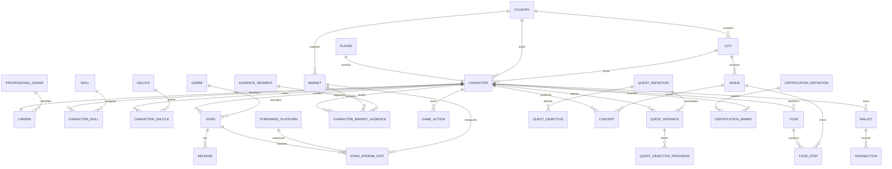

# MODEL RELATIONSHIPS — V0

## Design notes
- `origin_country` is permanent identity.
- `market` represents access and career presence; it is not equivalent to relocation.
- `game_action` is the generic foundation for timed work such as recording, concerts and tours.
- `event_instance` and `player_event` separate global scheduling from player-specific progress.
- XP/level and professional grade are intentionally separated.
